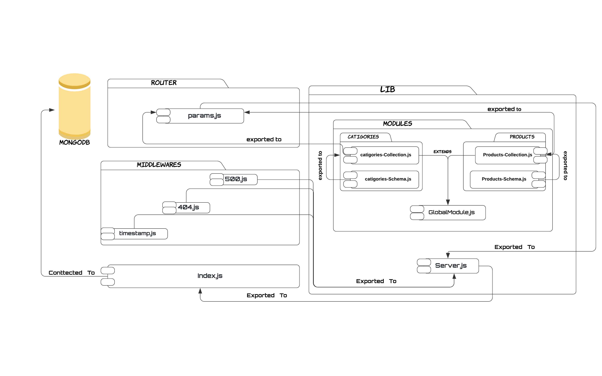

# api-server - class 7

### Author: Mohammad Almokdad
### Links and Resources

- [Main Repo](https://github.com/mohammadalmoqdad/api-server)
- [PR1](https://github.com/mohammadalmoqdad/api-server/pull/1)
- [PR2](https://github.com/mohammadalmoqdad/api-server/pull/2)

- [back-end server url]()
- [front-end application]()

### Setup
- *express* : for building server.
- *supertest* : for testing the routes(I mport the server to it).

## Notes:
- `beforeEach` && `AfterEach` are used to do things before and atfer doing excution of something.
#### `.env` requirements (where applicable)

i.e.

- `PORT` - 3000
- `MONGODB_URI` - "mongodb//:localhost:27017/dbName"

#### How to initialize/run your application (where applicable)
1. install packages.
2. run the index in terminal after importing server in it.
3. run using postman and define the routes verbs(get,put)

#### Tests
- test server and middlewares seperatly

[My URL is](https://app.swaggerhub.com/apis/mukdad/default-title/0.1)

